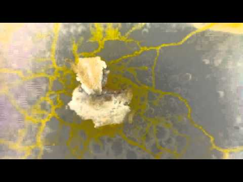
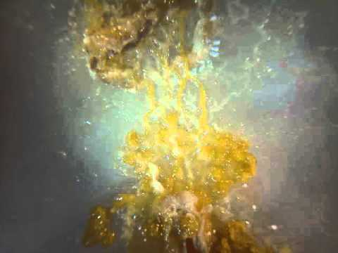

## Repo for slime mold project within course “Eingabe/Ausgabe — Fundamentals of process oriented design” FHP - University of Applied Sciences Potsdam.

When we started the second project, we first of all had to get our raspberry pis up and running. That means, getting to know the command line, basics about the raspberry pi as in finding out how to even find it on the network, communicate with it via ssh and get files to and from it via sftp. We also heard a lot about physical computing, learned a lot about technical/electronic engineering and sensors and actuators as well as projects involving Arduino and/or Raspberry Pi. As we dig deeper into the capabilities of the Raspberry Pi and the Linux system running on it, we heard about and experimented a lot with computer vision. Making things like this little electronic box see and to be able to give it the ability to detect faces, colors, text and other forms was not easy, but really exciting.
Processing.py was the language that we used for this which made things a lot easier since the Processing language is really close to the Arduino language, therefore actually quite easy to learn to understand whilst keeping an comprehensive amount of application possibilities.
We also got pretty deep into topics like camouflage hair and makeup styles that keep one from being detected by computer vision and other philosophical aspects about the ubiquity of this new technology.

After we got the Raspberry Pi up and running, we started into the field Biocomputing. That means, each of us got a Petri Dish and a piece of slime mold. We absolved a one day training course on how to care for your own personal slime mold: feed it with oats so it gets bigger, keep it away from ultraviolet light, always keep it as aseptic as possible, read stories before putting it to sleep and so on…
But our effort got rewarded when we saw those little buddies grow: where ever an oat flake would be in reach, little buddy slimey would wander in its direction and swallow the whole thing up.
After all this joy about them, our first goal was to program the Raspberry Pi so that it takes pictures in an interval, only lighting up the connected LEDs in the moment the picture is taken.
From these pictures, we then were able to create beautiful high speed growing slime mold videos. For my pi-camera, I used a smartphone camera macro clip on lens to have a better view on the details and 6 white high power LEDs behind a white plexi glass diffusor:

After filming the time lapses, we would use them as a parametric input for computer vision.
My idea was to create a CNC-style platform, allowing my pi-driven macro camera to move around a larger area. This would give the slime mold more space to wander around munching oat flakes, always followed by the time lapse camera.
So I started to build the platform from scratch out of plexi glass, 4 drawer ball-bearing runners, 2 stepper motors + drivers, 2 threaded rods, an arduino and a lot of cable.

After it was built, so it moves smooth, I had to get the stepper motors running, which was harder than I expected. For the position of the camera must at all times be monitored, the arduino always has to know exactly, how many turns each motor has taken. I used the [Easy Driver](schmalzhaus.com/EasyDriver), which is easier to control than other ways like using an H-Bridge. The big problem that occurred to me was that I would get different speeds, depending on if I’m trying to move one or two motors. Therefore, the camera couldn’t maintain a monitored position. Since all the slime molds were moldy or dried out by this time, it was just the right time to move on to the next project.

## License:

# The MIT License (MIT)

# Copyright (c) 2015 Christian Pflug

Permission is hereby granted, free of charge, to any person obtaining a copy
of this software and associated documentation files (the "Software"), to deal
in the Software without restriction, including without limitation the rights
to use, copy, modify, merge, publish, distribute, sublicense, and/or sell
copies of the Software, and to permit persons to whom the Software is
furnished to do so, subject to the following conditions:

The above copyright notice and this permission notice shall be included in all
copies or substantial portions of the Software.

THE SOFTWARE IS PROVIDED "AS IS", WITHOUT WARRANTY OF ANY KIND, EXPRESS OR
IMPLIED, INCLUDING BUT NOT LIMITED TO THE WARRANTIES OF MERCHANTABILITY,
FITNESS FOR A PARTICULAR PURPOSE AND NONINFRINGEMENT. IN NO EVENT SHALL THE
AUTHORS OR COPYRIGHT HOLDERS BE LIABLE FOR ANY CLAIM, DAMAGES OR OTHER
LIABILITY, WHETHER IN AN ACTION OF CONTRACT, TORT OR OTHERWISE, ARISING FROM,
OUT OF OR IN CONNECTION WITH THE SOFTWARE OR THE USE OR OTHER DEALINGS IN THE
SOFTWARE.
